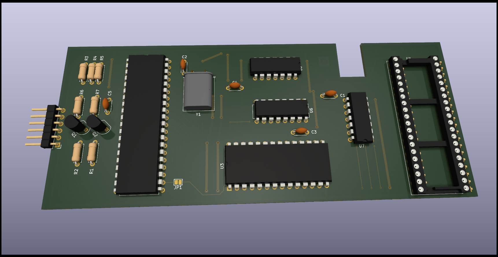

# Unknow Keyboard Interface for Sinclair QL
A reverse engineering exercice using a unknow Keyboard adapter for Sinclair QL found on internet.

Licensed under Cern OHL-S - https://ohwr.org/cern_ohl_s_v2.txt

Thanks to XorA for the adition information.

## WARNING: DO NOT USE THIS PROJECT IS NOT TESTED AND MISSING THINGS
This is not a functional item, it's only a exercice of reverse engineering to reinforce my skills in Kicad EDA Software.

This project was done using freely available pictures of the interface found on internet.

Schematic shall be correct, but be aware that this interface was with a DIN-6 conector, and I do not know any type of Keyboard that use this conector, also all wires are in use, so the keyboard is unknow. I suspect of any kind of Serial-Ascii keyboard, but have no information.

Also this project is completely useless without the firmware of the microcontroller an ROM.

## Firmware

U2 is a D8749HC microcontroller with a 2Kb of OTP ROM, it shall contains some kind of Keyboard to Ascii interfac.

U3 is a 27F64 8Kb EPROM, and contain a lookup table to convert the Ascii ouput of U2 to the Matrix of the QL computer.

Original QL or Hermes chip shall be placed on the U1 Socket.

## Comparative

